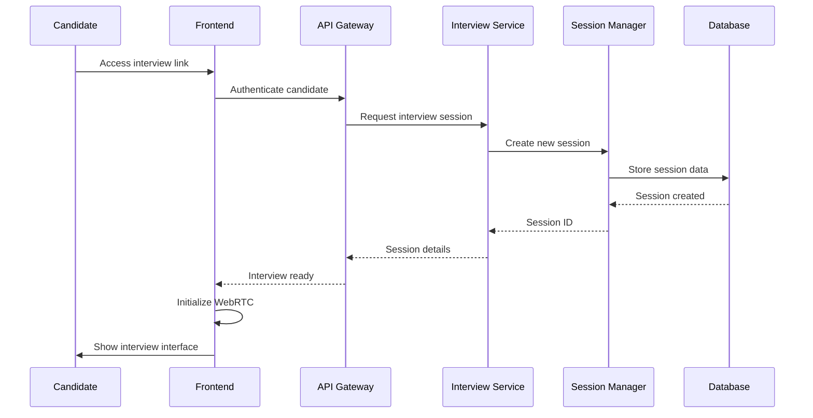
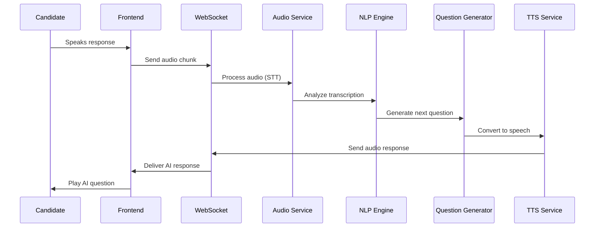

# AI Interviewer System Architecture

## 1. System Overview

The AI Interviewer is a real-time, intelligent interview platform that conducts automated interviews using voice interaction, natural language processing, and adaptive questioning algorithms.

## 2. High-Level Architecture

### 2.1 Core Components

```
┌─────────────────┐    ┌─────────────────┐    ┌─────────────────┐
│   Frontend      │    │   Backend       │    │   AI Services   │
│   (Web Client)  │◄──►│   (API Server)  │◄──►│   (ML Pipeline) │
└─────────────────┘    └─────────────────┘    └─────────────────┘
         │                       │                       │
         ▼                       ▼                       ▼
┌─────────────────┐    ┌─────────────────┐    ┌─────────────────┐
│   WebRTC/       │    │   Database      │    │   External      │
│   WebSocket     │    │   Layer         │    │   APIs          │
└─────────────────┘    └─────────────────┘    └─────────────────┘
```

### 2.2 Detailed Component Architecture

```
                    ┌─────────────────────────────────────────────────────────┐
                    │                    Frontend Layer                        │
                    │  ┌─────────────┐  ┌─────────────┐  ┌─────────────────┐  │
                    │  │   React     │  │   WebRTC    │  │   Audio/Video   │  │
                    │  │   Client    │  │   Client    │  │   Components    │  │
                    │  └─────────────┘  └─────────────┘  └─────────────────┘  │
                    └─────────────────────────────────────────────────────────┘
                                              │
                                              ▼
                    ┌─────────────────────────────────────────────────────────┐
                    │                   API Gateway                           │
                    │  ┌─────────────┐  ┌─────────────┐  ┌─────────────────┐  │
                    │  │   Auth      │  │   Rate      │  │   Load          │  │
                    │  │   Service   │  │   Limiting  │  │   Balancer      │  │
                    │  └─────────────┘  └─────────────┘  └─────────────────┘  │
                    └─────────────────────────────────────────────────────────┘
                                              │
                                              ▼
┌─────────────────┐ ┌─────────────────────────────────────────────────────────┐
│                 │ │                  Backend Services                       │
│   Real-time     │ │  ┌─────────────┐  ┌─────────────┐  ┌─────────────────┐  │
│   Communication │◄┤  │  Interview  │  │   Session   │  │   User          │  │
│                 │ │  │  Service    │  │   Manager   │  │   Management    │  │
│   • WebSocket   │ │  └─────────────┘  └─────────────┘  └─────────────────┘  │
│   • WebRTC      │ │                                                         │
│   • STUN/TURN   │ │  ┌─────────────┐  ┌─────────────┐  ┌─────────────────┐  │
│                 │ │  │  Audio      │  │  Analytics  │  │   Notification  │  │
│                 │ │  │  Processing │  │  Service    │  │   Service       │  │
└─────────────────┘ │  └─────────────┘  └─────────────┘  └─────────────────┘  │
                    └─────────────────────────────────────────────────────────┘
                                              │
                                              ▼
                    ┌─────────────────────────────────────────────────────────┐
                    │                   AI/ML Pipeline                        │
                    │  ┌─────────────┐  ┌─────────────┐  ┌─────────────────┐  │
                    │  │   Speech    │  │    NLP      │  │   Question      │  │
                    │  │   Services  │  │   Engine    │  │   Generator     │  │
                    │  └─────────────┘  └─────────────┘  └─────────────────┘  │
                    │                                                         │
                    │  ┌─────────────┐  ┌─────────────┐  ┌─────────────────┐  │
                    │  │   Response  │  │  Sentiment  │  │   Interview     │  │
                    │  │   Analyzer  │  │  Analysis   │  │   Evaluator     │  │
                    │  └─────────────┘  └─────────────┘  └─────────────────┘  │
                    └─────────────────────────────────────────────────────────┘
                                              │
                                              ▼
                    ┌─────────────────────────────────────────────────────────┐
                    │                   Data Layer                            │
                    │  ┌─────────────┐  ┌─────────────┐  ┌─────────────────┐  │
                    │  │  PostgreSQL │  │    Redis    │  │   File Storage  │  │
                    │  │  (Primary)  │  │   (Cache)   │  │   (S3/MinIO)    │  │
                    │  └─────────────┘  └─────────────┘  └─────────────────┘  │
                    └─────────────────────────────────────────────────────────┘
```

## 3. Detailed Component Specifications

### 3.1 Frontend Layer

#### 3.1.1 React Client
- **Technology**: React 18+ with TypeScript
- **State Management**: Redux Toolkit or Zustand
- **UI Framework**: Material-UI or Tailwind CSS
- **Real-time Features**: Socket.io-client

#### 3.1.2 WebRTC Client
- **Audio/Video Capture**: MediaDevices API
- **Peer Connection**: RTCPeerConnection
- **Data Channels**: For low-latency text communication
- **Media Constraints**: Audio quality optimization

#### 3.1.3 Audio/Video Components
- **Audio Visualization**: Real-time waveform display
- **Recording Controls**: Start/stop/pause functionality
- **Quality Indicators**: Connection and audio quality metrics

### 3.2 Backend Services

#### 3.2.1 Interview Service
```typescript
interface InterviewService {
  startInterview(candidateId: string, jobRole: string): Promise<InterviewSession>
  processResponse(sessionId: string, audioData: Buffer): Promise<InterviewResponse>
  generateQuestion(context: InterviewContext): Promise<Question>
  evaluateResponse(response: string, question: Question): Promise<Evaluation>
  endInterview(sessionId: string): Promise<InterviewReport>
}
```

#### 3.2.2 Session Manager
```typescript
interface SessionManager {
  createSession(candidateId: string): Promise<Session>
  updateSession(sessionId: string, data: Partial<Session>): Promise<void>
  getSession(sessionId: string): Promise<Session>
  cleanupExpiredSessions(): Promise<void>
}
```

#### 3.2.3 Audio Processing Service
```typescript
interface AudioProcessingService {
  speechToText(audioBuffer: Buffer): Promise<string>
  textToSpeech(text: string, voice: VoiceConfig): Promise<Buffer>
  enhanceAudio(audioBuffer: Buffer): Promise<Buffer>
  detectSpeechEnd(audioStream: ReadableStream): Promise<boolean>
}
```

### 3.3 AI/ML Pipeline

#### 3.3.1 Speech Services
- **Speech-to-Text**: 
  - Primary: OpenAI Whisper API
  - Fallback: Google Speech-to-Text
  - Real-time streaming support
- **Text-to-Speech**:
  - Primary: ElevenLabs or Azure Cognitive Services
  - Voice cloning capabilities
  - Emotion and tone control

#### 3.3.2 NLP Engine
```typescript
interface NLPEngine {
  analyzeResponse(text: string): Promise<ResponseAnalysis>
  extractKeywords(text: string): Promise<string[]>
  assessTechnicalSkills(response: string, domain: string): Promise<SkillAssessment>
  detectLanguageProficiency(text: string): Promise<LanguageScore>
}
```

#### 3.3.3 Question Generator
```typescript
interface QuestionGenerator {
  generateFollowUp(previousResponse: string, context: InterviewContext): Promise<Question>
  selectNextQuestion(candidateProfile: Profile, interviewProgress: Progress): Promise<Question>
  adaptDifficulty(performanceMetrics: Metrics): Promise<DifficultyLevel>
}
```

## 4. Data Models

### 4.1 Core Entities

```typescript
interface Candidate {
  id: string
  name: string
  email: string
  resumeUrl?: string
  skills: string[]
  experience: number
  createdAt: Date
  updatedAt: Date
}

interface InterviewSession {
  id: string
  candidateId: string
  jobRole: string
  status: 'waiting' | 'in_progress' | 'completed' | 'cancelled'
  startTime: Date
  endTime?: Date
  currentQuestionIndex: number
  responses: InterviewResponse[]
  overallScore?: number
  createdAt: Date
  updatedAt: Date
}

interface InterviewResponse {
  id: string
  sessionId: string
  questionId: string
  audioUrl: string
  transcription: string
  duration: number
  confidence: number
  sentiment: SentimentScore
  technicalScore?: number
  communicationScore?: number
  timestamp: Date
}

interface Question {
  id: string
  type: 'introduction' | 'technical' | 'behavioral' | 'situational' | 'closing'
  difficulty: 'easy' | 'medium' | 'hard'
  domain: string
  text: string
  expectedKeywords: string[]
  followUpQuestions?: string[]
  timeLimit: number
}

interface InterviewReport {
  sessionId: string
  candidateId: string
  overallScore: number
  technicalScore: number
  communicationScore: number
  strengths: string[]
  weaknesses: string[]
  recommendations: string[]
  detailedFeedback: ResponseFeedback[]
  generatedAt: Date
}
```

## 5. API Specifications

### 5.1 REST API Endpoints

```yaml
# Interview Management
POST /api/v1/interviews
GET /api/v1/interviews/{sessionId}
PUT /api/v1/interviews/{sessionId}
DELETE /api/v1/interviews/{sessionId}

# Audio Processing
POST /api/v1/audio/speech-to-text
POST /api/v1/audio/text-to-speech
POST /api/v1/audio/upload

# Candidate Management
POST /api/v1/candidates
GET /api/v1/candidates/{candidateId}
PUT /api/v1/candidates/{candidateId}

# Reports and Analytics
GET /api/v1/reports/{sessionId}
GET /api/v1/analytics/performance
GET /api/v1/analytics/trends
```

### 5.2 WebSocket Events

```typescript
// Client to Server
interface ClientEvents {
  'join-interview': { sessionId: string, candidateId: string }
  'audio-chunk': { sessionId: string, audioData: ArrayBuffer, sequence: number }
  'speech-end': { sessionId: string }
  'candidate-ready': { sessionId: string }
}

// Server to Client
interface ServerEvents {
  'interview-started': { sessionId: string, firstQuestion: Question }
  'question-generated': { question: Question, timeLimit: number }
  'response-processed': { feedback: string, nextQuestion?: Question }
  'interview-completed': { reportId: string, summary: InterviewSummary }
  'error': { code: string, message: string }
}
```

## 6. System Flow Diagrams

### 6.1 Interview Initialization Flow



### 6.2 Real-time Interview Flow



## 7. Technology Stack

### 7.1 Frontend
- **Framework**: React 18+ with TypeScript
- **Build Tool**: Vite or Create React App
- **State Management**: Redux Toolkit
- **UI Library**: Material-UI or Chakra UI
- **WebRTC**: Simple-peer or native WebRTC APIs
- **Audio Processing**: Web Audio API

### 7.2 Backend
- **Runtime**: Node.js 18+ or Python 3.9+
- **Framework**: Express.js/Fastify or FastAPI
- **Database**: PostgreSQL 14+
- **Cache**: Redis 7+
- **Message Queue**: Bull/BullMQ or Celery
- **File Storage**: AWS S3 or MinIO

### 7.3 AI/ML Services
- **Speech-to-Text**: OpenAI Whisper, Google Speech-to-Text
- **Text-to-Speech**: ElevenLabs, Azure Cognitive Services
- **NLP**: OpenAI GPT-4, Anthropic Claude
- **ML Framework**: TensorFlow or PyTorch (for custom models)

### 7.4 Infrastructure
- **Container**: Docker
- **Orchestration**: Kubernetes or Docker Compose
- **API Gateway**: Kong or AWS API Gateway
- **Monitoring**: Prometheus + Grafana
- **Logging**: ELK Stack or Loki

## 8. Security Considerations

### 8.1 Authentication & Authorization
- JWT-based authentication
- Role-based access control (RBAC)
- OAuth 2.0 integration
- Session management with Redis

### 8.2 Data Protection
- End-to-end encryption for audio data
- GDPR compliance for candidate data
- Audio data retention policies
- Secure file storage with encryption at rest

### 8.3 Network Security
- HTTPS/WSS for all communications
- CORS configuration
- Rate limiting and DDoS protection
- WebRTC security (STUN/TURN with authentication)

## 9. Performance & Scalability

### 9.1 Performance Targets
- Audio latency: < 200ms
- Speech-to-text processing: < 2s
- Question generation: < 3s
- Concurrent interviews: 100+ per server

### 9.2 Scalability Strategy
- Horizontal scaling with load balancers
- Microservices architecture
- Database sharding for large datasets
- CDN for static assets and audio files
- Auto-scaling based on demand

## 10. Monitoring & Analytics

### 10.1 System Metrics
- Response times for each service
- Audio quality metrics
- WebRTC connection statistics
- Database performance metrics

### 10.2 Business Metrics
- Interview completion rates
- Candidate satisfaction scores
- AI accuracy metrics
- System uptime and availability

## 11. Deployment Architecture

### 11.1 Production Environment
```yaml
# docker-compose.yml structure
services:
  frontend:
    build: ./frontend
    ports: ["80:80"]
  
  api-gateway:
    image: kong:latest
    ports: ["8000:8000"]
  
  interview-service:
    build: ./services/interview
    environment:
      - DATABASE_URL
      - REDIS_URL
  
  audio-service:
    build: ./services/audio
    volumes:
      - ./models:/app/models
  
  database:
    image: postgres:14
    volumes:
      - pgdata:/var/lib/postgresql/data
  
  redis:
    image: redis:7-alpine
    volumes:
      - redisdata:/data
```

This comprehensive architecture provides a robust, scalable, and maintainable foundation for the AI Interviewer system. Each component is designed to be independently deployable and scalable based on demand.