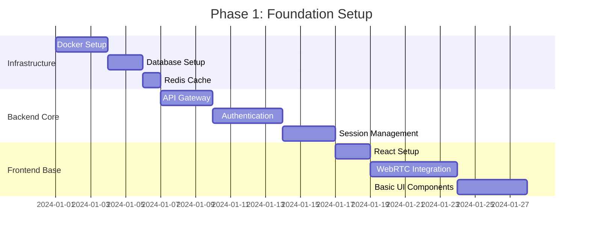
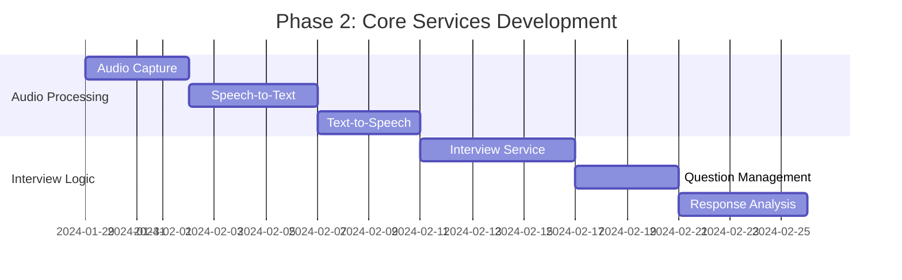
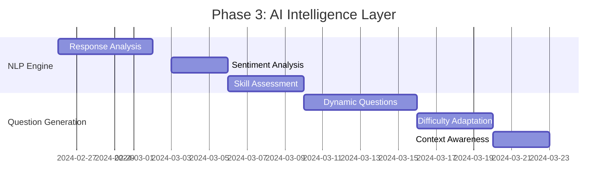
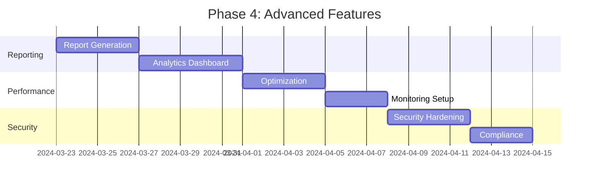

# AI Interviewer - Implementation Roadmap & Design Analysis

## 1. Original Design vs. Refined Architecture Comparison

### 1.1 Your Original Design Strengths
✅ **Correctly Identified Core Components:**
- Candidate interaction flow
- Speech-to-text (Whisper) integration
- Text-to-speech functionality
- Real-time communication (WebRTC/WebSocket)
- Iterative question-response loop

✅ **Good High-Level Flow:**
- Clear sequence of candidate joining
- Proper speech processing pipeline
- Continuous interview loop structure

### 1.2 Areas Enhanced in Refined Architecture

| Original Design | Refined Architecture | Improvement |
|----------------|---------------------|-------------|
| Basic AI_Interviewer component | Microservices architecture | Better scalability & maintainability |
| Simple WebRTC/WebSocket | API Gateway + Load Balancer | Production-ready infrastructure |
| No data persistence shown | PostgreSQL + Redis + File Storage | Proper data management |
| No error handling | Comprehensive error handling & recovery | System reliability |
| No authentication | JWT + OAuth + RBAC | Security & user management |
| No monitoring | Performance monitoring + analytics | Operational visibility |
| Single AI service | Multiple specialized AI services | Better performance & flexibility |

## 2. Implementation Phases

### Phase 1: Foundation (Weeks 1-4)


**Deliverables:**
- [ ] Docker containerization setup
- [ ] PostgreSQL database with initial schema
- [ ] Redis cache configuration
- [ ] API Gateway (Kong/Nginx) setup
- [ ] JWT authentication system
- [ ] Session management service
- [ ] Basic React frontend with WebRTC
- [ ] CI/CD pipeline setup

### Phase 2: Core Services (Weeks 5-8)


**Deliverables:**
- [ ] Audio capture and streaming
- [ ] Whisper STT integration
- [ ] TTS service integration
- [ ] Interview session management
- [ ] Basic question bank
- [ ] Response analysis engine
- [ ] WebSocket real-time communication

### Phase 3: AI Intelligence (Weeks 9-12)


**Deliverables:**
- [ ] Advanced NLP response analysis
- [ ] Sentiment and emotion detection
- [ ] Technical skill assessment
- [ ] Dynamic question generation
- [ ] Adaptive difficulty system
- [ ] Context-aware follow-up questions

### Phase 4: Advanced Features (Weeks 13-16)


**Deliverables:**
- [ ] Comprehensive interview reports
- [ ] Analytics dashboard
- [ ] Performance optimization
- [ ] Monitoring and alerting
- [ ] Security hardening
- [ ] GDPR compliance features

## 3. Technical Implementation Details

### 3.1 Backend Service Architecture

```typescript
// Interview Service Structure
src/
├── services/
│   ├── interview/
│   │   ├── controllers/
│   │   │   ├── InterviewController.ts
│   │   │   └── SessionController.ts
│   │   ├── services/
│   │   │   ├── InterviewService.ts
│   │   │   ├── QuestionService.ts
│   │   │   └── EvaluationService.ts
│   │   ├── models/
│   │   │   ├── Interview.ts
│   │   │   ├── Question.ts
│   │   │   └── Response.ts
│   │   └── routes/
│   │       └── interview.routes.ts
│   ├── audio/
│   │   ├── controllers/
│   │   │   └── AudioController.ts
│   │   ├── services/
│   │   │   ├── STTService.ts
│   │   │   ├── TTSService.ts
│   │   │   └── AudioProcessingService.ts
│   │   └── utils/
│   │       ├── audioUtils.ts
│   │       └── whisperClient.ts
│   └── ai/
│       ├── services/
│       │   ├── NLPService.ts
│       │   ├── QuestionGeneratorService.ts
│       │   └── ResponseAnalyzerService.ts
│       └── models/
│           ├── AIModels.ts
│           └── PromptTemplates.ts
```

### 3.2 Frontend Component Structure

```typescript
// React Frontend Structure
src/
├── components/
│   ├── Interview/
│   │   ├── InterviewRoom.tsx
│   │   ├── AudioControls.tsx
│   │   ├── QuestionDisplay.tsx
│   │   └── ResponseTimer.tsx
│   ├── Audio/
│   │   ├── AudioCapture.tsx
│   │   ├── AudioPlayer.tsx
│   │   └── AudioVisualizer.tsx
│   └── Common/
│       ├── LoadingSpinner.tsx
│       └── ErrorBoundary.tsx
├── hooks/
│   ├── useWebRTC.ts
│   ├── useAudioCapture.ts
│   ├── useWebSocket.ts
│   └── useInterview.ts
├── services/
│   ├── api.ts
│   ├── websocket.ts
│   └── webrtc.ts
└── store/
    ├── interviewSlice.ts
    ├── audioSlice.ts
    └── store.ts
```

### 3.3 Database Schema Design

```sql
-- Core Tables
CREATE TABLE candidates (
    id UUID PRIMARY KEY DEFAULT gen_random_uuid(),
    name VARCHAR(255) NOT NULL,
    email VARCHAR(255) UNIQUE NOT NULL,
    resume_url TEXT,
    skills JSONB,
    experience_years INTEGER,
    created_at TIMESTAMP DEFAULT NOW(),
    updated_at TIMESTAMP DEFAULT NOW()
);

CREATE TABLE interview_sessions (
    id UUID PRIMARY KEY DEFAULT gen_random_uuid(),
    candidate_id UUID REFERENCES candidates(id),
    job_role VARCHAR(255) NOT NULL,
    status VARCHAR(50) DEFAULT 'waiting',
    start_time TIMESTAMP,
    end_time TIMESTAMP,
    current_question_index INTEGER DEFAULT 0,
    overall_score DECIMAL(3,2),
    metadata JSONB,
    created_at TIMESTAMP DEFAULT NOW(),
    updated_at TIMESTAMP DEFAULT NOW()
);

CREATE TABLE questions (
    id UUID PRIMARY KEY DEFAULT gen_random_uuid(),
    type VARCHAR(50) NOT NULL,
    difficulty VARCHAR(20) NOT NULL,
    domain VARCHAR(100),
    text TEXT NOT NULL,
    expected_keywords JSONB,
    follow_up_questions JSONB,
    time_limit INTEGER DEFAULT 120,
    created_at TIMESTAMP DEFAULT NOW()
);

CREATE TABLE interview_responses (
    id UUID PRIMARY KEY DEFAULT gen_random_uuid(),
    session_id UUID REFERENCES interview_sessions(id),
    question_id UUID REFERENCES questions(id),
    audio_url TEXT,
    transcription TEXT,
    duration INTEGER,
    confidence DECIMAL(3,2),
    sentiment_score JSONB,
    technical_score DECIMAL(3,2),
    communication_score DECIMAL(3,2),
    analysis_results JSONB,
    timestamp TIMESTAMP DEFAULT NOW()
);

CREATE TABLE interview_reports (
    id UUID PRIMARY KEY DEFAULT gen_random_uuid(),
    session_id UUID REFERENCES interview_sessions(id),
    overall_score DECIMAL(3,2),
    technical_score DECIMAL(3,2),
    communication_score DECIMAL(3,2),
    strengths JSONB,
    weaknesses JSONB,
    recommendations JSONB,
    detailed_feedback JSONB,
    generated_at TIMESTAMP DEFAULT NOW()
);
```

## 4. Key Implementation Decisions

### 4.1 Technology Choices Justification

| Component | Technology | Justification |
|-----------|------------|---------------|
| **Frontend** | React + TypeScript | Strong ecosystem, WebRTC support, type safety |
| **Backend** | Node.js + Express | JavaScript uniformity, real-time capabilities |
| **Database** | PostgreSQL | ACID compliance, JSON support, scalability |
| **Cache** | Redis | Session management, real-time data |
| **STT** | OpenAI Whisper | Best accuracy, multilingual support |
| **TTS** | ElevenLabs/Azure | Natural voice synthesis, emotion control |
| **NLP** | OpenAI GPT-4 | Advanced reasoning, context understanding |
| **WebRTC** | Native APIs | Direct browser support, low latency |

### 4.2 Scalability Considerations

```yaml
# Kubernetes Deployment Strategy
apiVersion: apps/v1
kind: Deployment
metadata:
  name: interview-service
spec:
  replicas: 3
  selector:
    matchLabels:
      app: interview-service
  template:
    spec:
      containers:
      - name: interview-service
        image: ai-interviewer/interview-service:latest
        resources:
          requests:
            memory: "512Mi"
            cpu: "250m"
          limits:
            memory: "1Gi"
            cpu: "500m"
        env:
        - name: DATABASE_URL
          valueFrom:
            secretKeyRef:
              name: db-secret
              key: url
---
apiVersion: v1
kind: Service
metadata:
  name: interview-service
spec:
  selector:
    app: interview-service
  ports:
  - port: 3000
    targetPort: 3000
  type: ClusterIP
```

## 5. Performance Benchmarks & SLAs

### 5.1 Target Performance Metrics

| Metric | Target | Measurement |
|--------|--------|-------------|
| **Audio Latency** | < 200ms | End-to-end audio processing |
| **STT Processing** | < 2s | Audio to text conversion |
| **Question Generation** | < 3s | AI response generation |
| **System Availability** | 99.9% | Uptime monitoring |
| **Concurrent Users** | 100+ | Per server instance |
| **Database Response** | < 100ms | Query execution time |

### 5.2 Load Testing Strategy

```javascript
// K6 Load Testing Script
import { check } from 'k6';
import ws from 'k6/ws';
import { Rate } from 'k6/metrics';

export let errorRate = new Rate('errors');

export let options = {
  stages: [
    { duration: '2m', target: 10 },  // Ramp up
    { duration: '5m', target: 50 },  // Stay at 50 users
    { duration: '2m', target: 100 }, // Ramp to 100 users
    { duration: '5m', target: 100 }, // Stay at 100 users
    { duration: '2m', target: 0 },   // Ramp down
  ],
};

export default function () {
  const url = 'ws://localhost:3000/ws';
  const params = { tags: { my_tag: 'interview_test' } };

  const res = ws.connect(url, params, function (socket) {
    socket.on('open', () => {
      socket.send(JSON.stringify({
        type: 'join-interview',
        sessionId: 'test-session',
        candidateId: 'test-candidate'
      }));
    });

    socket.on('message', (data) => {
      check(data, {
        'message received': (msg) => msg.length > 0,
      });
    });

    socket.setTimeout(() => {
      socket.close();
    }, 30000);
  });

  check(res, { 'status is 101': (r) => r && r.status === 101 });
}
```

## 6. Security Implementation Checklist

### 6.1 Authentication & Authorization
- [ ] JWT token implementation with refresh tokens
- [ ] OAuth 2.0 integration (Google, LinkedIn)
- [ ] Role-based access control (Candidate, Interviewer, Admin)
- [ ] API key management for external services
- [ ] Session timeout and management

### 6.2 Data Protection
- [ ] End-to-end encryption for audio streams
- [ ] Database encryption at rest
- [ ] HTTPS/WSS for all communications
- [ ] Audio file encryption in storage
- [ ] PII data anonymization options

### 6.3 Network Security
- [ ] CORS configuration
- [ ] Rate limiting per endpoint
- [ ] DDoS protection
- [ ] WebRTC STUN/TURN security
- [ ] Input validation and sanitization

## 7. Monitoring & Observability

### 7.1 Metrics Collection
```yaml
# Prometheus Configuration
global:
  scrape_interval: 15s

scrape_configs:
  - job_name: 'interview-service'
    static_configs:
      - targets: ['interview-service:3000']
    metrics_path: '/metrics'
    scrape_interval: 5s

  - job_name: 'audio-service'
    static_configs:
      - targets: ['audio-service:3001']
    metrics_path: '/metrics'
    scrape_interval: 5s
```

### 7.2 Alert Rules
```yaml
# Alertmanager Rules
groups:
- name: ai-interviewer
  rules:
  - alert: HighErrorRate
    expr: rate(http_requests_total{status=~"5.."}[5m]) > 0.1
    for: 5m
    labels:
      severity: critical
    annotations:
      summary: "High error rate detected"

  - alert: AudioLatencyHigh
    expr: audio_processing_duration_seconds > 0.2
    for: 2m
    labels:
      severity: warning
    annotations:
      summary: "Audio processing latency is high"
```

## 8. Deployment Strategy

### 8.1 Environment Setup
```bash
# Production Deployment Script
#!/bin/bash

# 1. Build and push Docker images
docker build -t ai-interviewer/frontend:latest ./frontend
docker build -t ai-interviewer/interview-service:latest ./services/interview
docker build -t ai-interviewer/audio-service:latest ./services/audio

# 2. Deploy to Kubernetes
kubectl apply -f k8s/namespace.yaml
kubectl apply -f k8s/secrets.yaml
kubectl apply -f k8s/configmaps.yaml
kubectl apply -f k8s/database.yaml
kubectl apply -f k8s/redis.yaml
kubectl apply -f k8s/services.yaml
kubectl apply -f k8s/ingress.yaml

# 3. Run database migrations
kubectl exec -it $(kubectl get pods -l app=interview-service -o jsonpath='{.items[0].metadata.name}') -- npm run migrate

# 4. Health check
kubectl get pods
kubectl get services
```

This comprehensive implementation roadmap transforms your original design into a production-ready, scalable AI Interviewer system. The refined architecture addresses all the missing components while preserving the core logic you correctly identified in your original design.