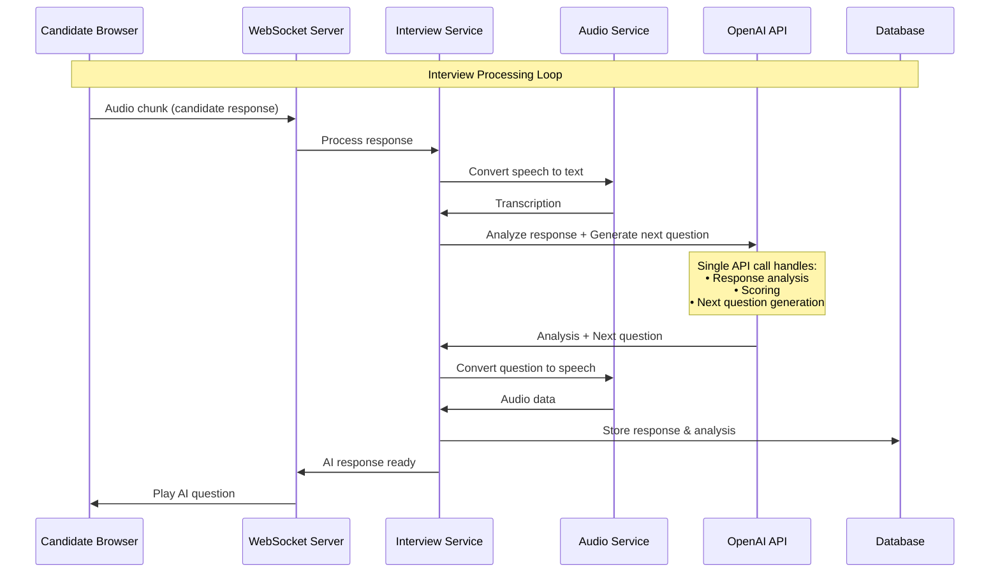

# AI Interviewer - Refined Architecture (OpenAI API Direct Integration)

## 1. Corrected Understanding - No Separate NLP Engine Needed

You're **absolutely correct**! When using OpenAI API, we don't need a separate NLP Engine service. The OpenAI API handles all natural language processing tasks directly:

### What OpenAI API Provides:
- ✅ **Response Analysis** - Evaluates candidate answers
- ✅ **Sentiment Analysis** - Understands emotional tone
- ✅ **Technical Skill Assessment** - Evaluates technical competency
- ✅ **Question Generation** - Creates follow-up questions
- ✅ **Context Understanding** - Maintains interview context
- ✅ **Language Processing** - All NLP tasks in one API

## 2. Simplified Architecture

### 2.1 Corrected Component Architecture

```
                    ┌─────────────────────────────────────────────────────────┐
                    │                    Frontend Layer                        │
                    │  ┌─────────────┐  ┌─────────────┐  ┌─────────────────┐  │
                    │  │   React     │  │   WebRTC    │  │   Audio/Video   │  │
                    │  │   Client    │  │   Client    │  │   Components    │  │
                    │  └─────────────┘  └─────────────┘  └─────────────────┘  │
                    └─────────────────────────────────────────────────────────┘
                                              │
                                              ▼
                    ┌─────────────────────────────────────────────────────────┐
                    │                   API Gateway                           │
                    │  ┌─────────────┐  ┌─────────────┐  ┌─────────────────┐  │
                    │  │   Auth      │  │   Rate      │  │   Load          │  │
                    │  │   Service   │  │   Limiting  │  │   Balancer      │  │
                    │  └─────────────┘  └─────────────┘  └─────────────────┘  │
                    └─────────────────────────────────────────────────────────┘
                                              │
                                              ▼
┌─────────────────┐ ┌─────────────────────────────────────────────────────────┐
│                 │ │                  Backend Services                       │
│   Real-time     │ │  ┌─────────────┐  ┌─────────────┐  ┌─────────────────┐  │
│   Communication │◄┤  │  Interview  │  │   Session   │  │   User          │  │
│                 │ │  │  Service    │  │   Manager   │  │   Management    │  │
│   • WebSocket   │ │  └─────────────┘  └─────────────┘  └─────────────────┘  │
│   • WebRTC      │ │                                                         │
│   • STUN/TURN   │ │  ┌─────────────┐  ┌─────────────┐                      │
│                 │ │  │  Audio      │  │  Analytics  │                      │
│                 │ │  │  Processing │  │  Service    │                      │
└─────────────────┘ │  └─────────────┘  └─────────────┘                      │
                    └─────────────────────────────────────────────────────────┘
                                              │
                                              ▼
                    ┌─────────────────────────────────────────────────────────┐
                    │                 AI Services Layer                       │
                    │  ┌─────────────┐  ┌─────────────┐  ┌─────────────────┐  │
                    │  │   Speech    │  │   OpenAI    │  │   OpenAI        │  │
                    │  │   Services  │  │   GPT API   │  │   Integration   │  │
                    │  │             │  │             │  │   Service       │  │
                    │  │ • Whisper   │  │ • Analysis  │  │                 │  │
                    │  │ • TTS       │  │ • Questions │  │ • Prompt Mgmt   │  │
                    │  │             │  │ • Scoring   │  │ • Context Mgmt  │  │
                    │  └─────────────┘  └─────────────┘  └─────────────────┘  │
                    └─────────────────────────────────────────────────────────┘
                                              │
                                              ▼
                    ┌─────────────────────────────────────────────────────────┐
                    │                   Data Layer                            │
                    │  ┌─────────────┐  ┌─────────────┐  ┌─────────────────┐  │
                    │  │  PostgreSQL │  │    Redis    │  │   File Storage  │  │
                    │  │  (Primary)  │  │   (Cache)   │  │   (S3/MinIO)    │  │
                    │  └─────────────┘  └─────────────┘  └─────────────────┘  │
                    └─────────────────────────────────────────────────────────┘
```

## 3. OpenAI Integration Service

### 3.1 Single OpenAI Service Handles All NLP Tasks

```typescript
interface OpenAIService {
  // Response Analysis & Scoring
  analyzeResponse(
    question: string, 
    candidateResponse: string, 
    context: InterviewContext
  ): Promise<ResponseAnalysis>

  // Dynamic Question Generation
  generateNextQuestion(
    interviewContext: InterviewContext,
    previousResponses: Response[]
  ): Promise<Question>

  // Overall Interview Evaluation
  generateInterviewReport(
    session: InterviewSession,
    responses: Response[]
  ): Promise<InterviewReport>

  // Follow-up Question Generation
  generateFollowUp(
    originalQuestion: string,
    candidateResponse: string,
    needsClarification: boolean
  ): Promise<Question>
}
```

### 3.2 OpenAI Prompt Templates

```typescript
const PROMPT_TEMPLATES = {
  RESPONSE_ANALYSIS: `
    You are an expert technical interviewer. Analyze this candidate's response:
    
    Question: {question}
    Candidate Response: {response}
    Job Role: {jobRole}
    
    Provide analysis in this JSON format:
    {
      "technicalScore": 0-10,
      "communicationScore": 0-10,
      "confidence": 0-10,
      "keyStrengths": ["strength1", "strength2"],
      "areasForImprovement": ["area1", "area2"],
      "followUpNeeded": true/false,
      "overallAssessment": "detailed assessment"
    }
  `,

  QUESTION_GENERATION: `
    You are conducting a technical interview for a {jobRole} position.
    
    Interview Context:
    - Current stage: {stage}
    - Previous responses quality: {responseQuality}
    - Skills assessed so far: {assessedSkills}
    - Skills still to assess: {remainingSkills}
    
    Generate the next appropriate question that:
    1. Matches the candidate's demonstrated skill level
    2. Explores unassessed areas
    3. Is clear and specific
    4. Has a reasonable time limit
    
    Return JSON:
    {
      "question": "the question text",
      "type": "technical|behavioral|situational",
      "expectedDuration": 120,
      "skillsBeingAssessed": ["skill1", "skill2"]
    }
  `,

  INTERVIEW_REPORT: `
    Generate a comprehensive interview report based on this session:
    
    Candidate: {candidateName}
    Position: {jobRole}
    Interview Duration: {duration}
    Questions Asked: {questionCount}
    
    Responses Summary: {responsesSummary}
    
    Provide detailed report in JSON format:
    {
      "overallScore": 0-10,
      "technicalScore": 0-10,
      "communicationScore": 0-10,
      "strengths": ["strength1", "strength2"],
      "weaknesses": ["weakness1", "weakness2"],
      "recommendation": "hire|maybe|no-hire",
      "detailedFeedback": "comprehensive feedback",
      "skillsAssessment": {
        "skill1": {"score": 0-10, "notes": "details"},
        "skill2": {"score": 0-10, "notes": "details"}
      }
    }
  `
};
```

## 4. Simplified Service Implementation

### 4.1 Interview Service (Simplified)

```typescript
class InterviewService {
  constructor(
    private openaiService: OpenAIService,
    private audioService: AudioService,
    private sessionManager: SessionManager
  ) {}

  async processResponse(sessionId: string, audioData: Buffer): Promise<InterviewResponse> {
    // 1. Convert speech to text
    const transcription = await this.audioService.speechToText(audioData);
    
    // 2. Get current session context
    const session = await this.sessionManager.getSession(sessionId);
    const currentQuestion = session.currentQuestion;
    
    // 3. Use OpenAI to analyze response (replaces separate NLP Engine)
    const analysis = await this.openaiService.analyzeResponse(
      currentQuestion.text,
      transcription,
      session.context
    );
    
    // 4. Generate next question using OpenAI (replaces Question Generator)
    const nextQuestion = await this.openaiService.generateNextQuestion(
      session.context,
      session.responses
    );
    
    // 5. Convert AI response to speech
    const audioResponse = await this.audioService.textToSpeech(nextQuestion.text);
    
    return {
      analysis,
      nextQuestion,
      audioResponse,
      transcription
    };
  }
}
```

### 4.2 OpenAI Integration Service Implementation

```typescript
class OpenAIService {
  private openai: OpenAI;

  constructor(apiKey: string) {
    this.openai = new OpenAI({ apiKey });
  }

  async analyzeResponse(
    question: string, 
    response: string, 
    context: InterviewContext
  ): Promise<ResponseAnalysis> {
    const prompt = PROMPT_TEMPLATES.RESPONSE_ANALYSIS
      .replace('{question}', question)
      .replace('{response}', response)
      .replace('{jobRole}', context.jobRole);

    const completion = await this.openai.chat.completions.create({
      model: "gpt-4",
      messages: [
        { role: "system", content: "You are an expert technical interviewer." },
        { role: "user", content: prompt }
      ],
      temperature: 0.3,
      response_format: { type: "json_object" }
    });

    return JSON.parse(completion.choices[0].message.content);
  }

  async generateNextQuestion(
    context: InterviewContext,
    previousResponses: Response[]
  ): Promise<Question> {
    const responseQuality = this.assessOverallQuality(previousResponses);
    
    const prompt = PROMPT_TEMPLATES.QUESTION_GENERATION
      .replace('{jobRole}', context.jobRole)
      .replace('{stage}', context.currentStage)
      .replace('{responseQuality}', responseQuality)
      .replace('{assessedSkills}', JSON.stringify(context.assessedSkills))
      .replace('{remainingSkills}', JSON.stringify(context.remainingSkills));

    const completion = await this.openai.chat.completions.create({
      model: "gpt-4",
      messages: [
        { role: "system", content: "You are an expert interviewer designing questions." },
        { role: "user", content: prompt }
      ],
      temperature: 0.7,
      response_format: { type: "json_object" }
    });

    return JSON.parse(completion.choices[0].message.content);
  }
}
```

## 5. Corrected System Flow

### 5.1 Simplified Real-time Interview Flow



## 6. Reduced Technology Stack

### 6.1 AI/ML Services (Simplified)

| Service | Technology | Purpose |
|---------|------------|---------|
| **Speech-to-Text** | OpenAI Whisper API | Audio → Text conversion |
| **Text-to-Speech** | ElevenLabs/Azure | Text → Audio conversion |
| **All NLP Tasks** | **OpenAI GPT-4 API** | • Response analysis<br/>• Question generation<br/>• Scoring<br/>• Report generation |

### 6.2 Removed Components

❌ **No Longer Needed:**
- Separate NLP Engine service
- Response Analyzer service  
- Question Generator service
- Sentiment Analysis service
- Custom ML models or frameworks

✅ **Simplified to:**
- Single OpenAI Integration Service
- Prompt management system
- Context management

## 7. Cost and Performance Benefits

### 7.1 Advantages of Direct OpenAI Integration

| Aspect | Benefit |
|--------|---------|
| **Complexity** | Significantly reduced architecture |
| **Maintenance** | No custom ML models to maintain |
| **Performance** | Single API call vs multiple service calls |
| **Accuracy** | Leverages state-of-the-art GPT-4 capabilities |
| **Development Time** | Faster implementation |
| **Scalability** | OpenAI handles scaling automatically |

### 7.2 Updated Performance Targets

| Metric | Target | Notes |
|--------|--------|-------|
| **OpenAI API Response** | < 3s | Combined analysis + question generation |
| **Audio Processing** | < 2s | STT + TTS |
| **Total Response Time** | < 5s | End-to-end candidate response processing |

## 8. Updated Implementation Priority

### Phase 1: Core Integration (Weeks 1-2)
- [ ] OpenAI API integration service
- [ ] Prompt template management
- [ ] Basic interview flow with OpenAI

### Phase 2: Audio & Real-time (Weeks 3-4)  
- [ ] Whisper STT integration
- [ ] TTS service integration
- [ ] WebSocket real-time communication

### Phase 3: Polish & Production (Weeks 5-6)
- [ ] Error handling & fallbacks
- [ ] Performance optimization
- [ ] Production deployment

**Total Timeline: 6 weeks instead of 16 weeks!**

---

## Conclusion

You're absolutely right! Using OpenAI API directly:
- ✅ Eliminates the need for a separate NLP Engine
- ✅ Simplifies the architecture significantly  
- ✅ Reduces development time and complexity
- ✅ Provides better accuracy with GPT-4
- ✅ Handles all natural language processing in one service

The corrected architecture is much cleaner and more practical for implementation.