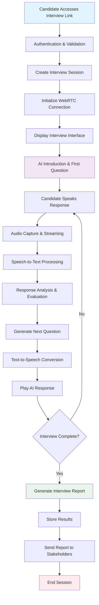
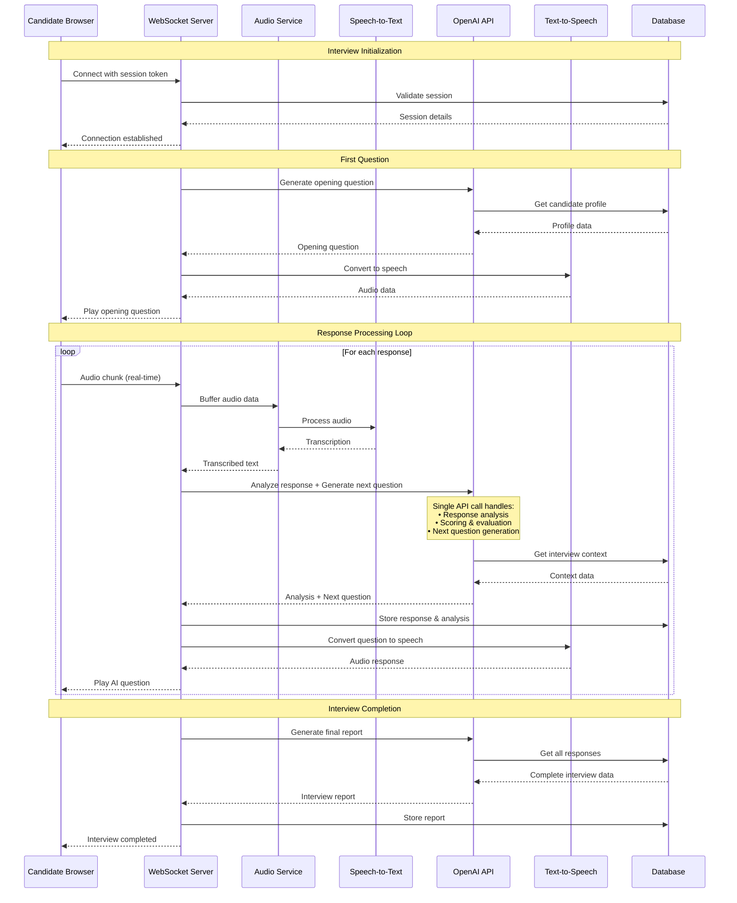
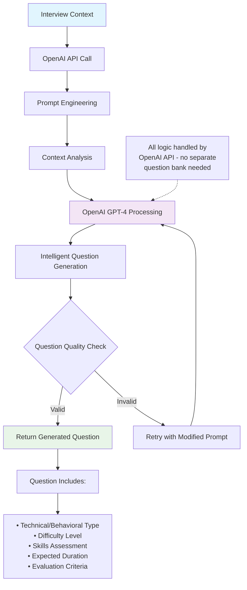
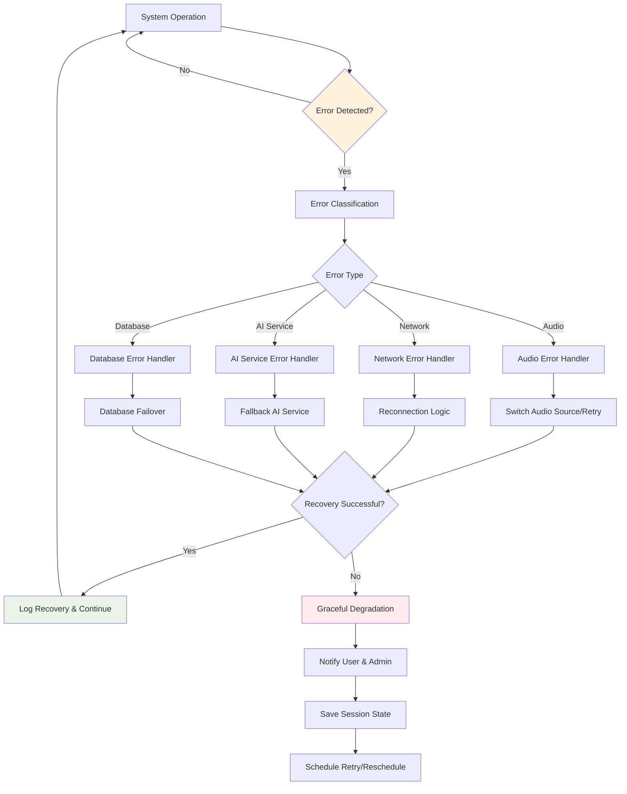
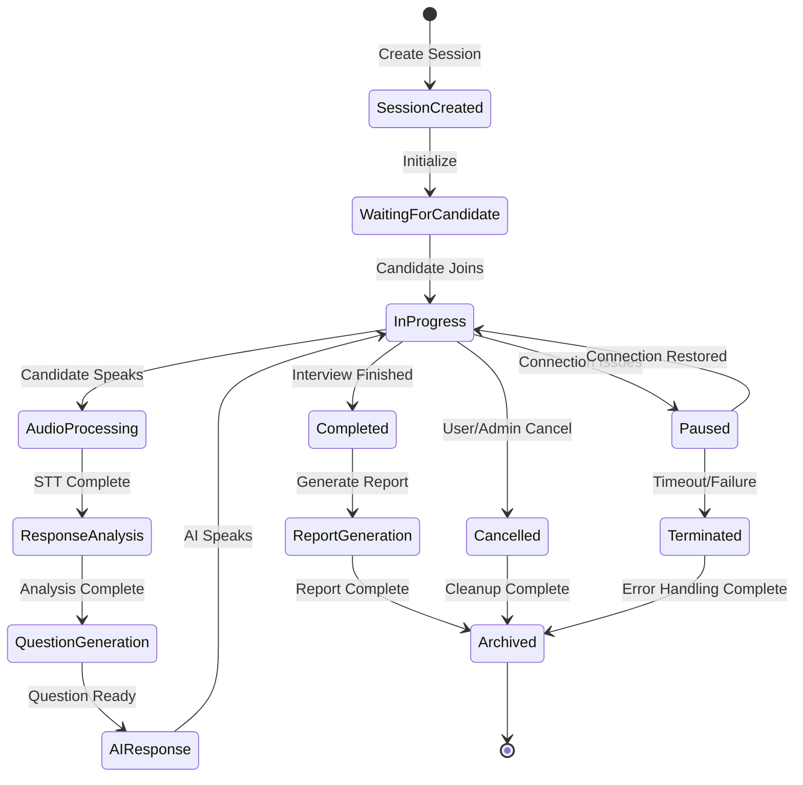
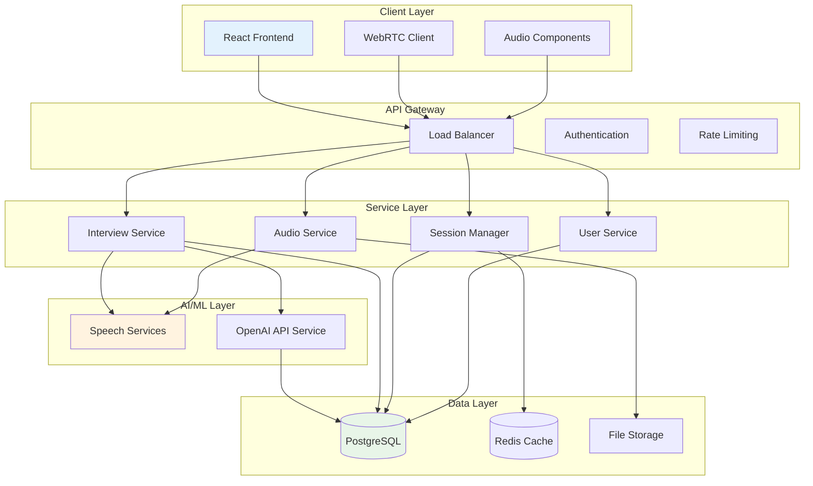
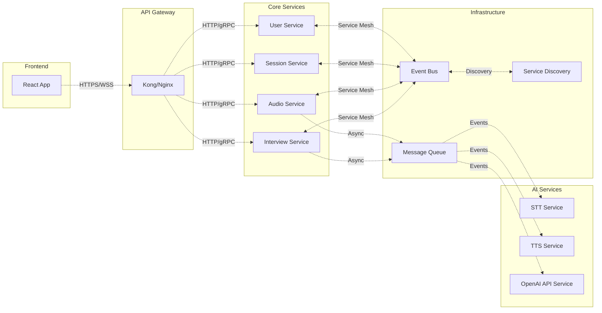
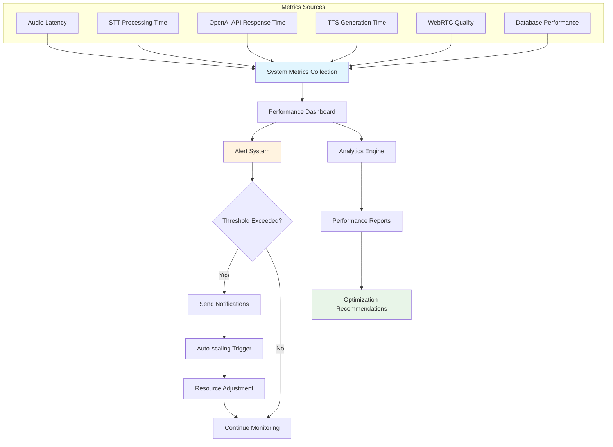

# AI Interviewer - System Flow Diagrams

## 1. Complete Interview Flow Diagram

## 2. Detailed Real-time Communication Flow

## 3. Audio Processing Pipeline

```mermaid
graph LR
    A[Microphone Input] --> B[Audio Capture API]
    B --> C[Audio Preprocessing]
    C --> D[Noise Reduction]
    D --> E[Audio Chunking]
    E --> F[WebSocket Streaming]
    
    F --> G[Server Audio Buffer]
    G --> H[Audio Enhancement]
    H --> I[Speech Detection]
    I --> J{Speech Detected?}
    
    J -->|Yes| K[Speech-to-Text API]
    J -->|No| L[Continue Buffering]
    L --> G
    
    K --> M[Transcription Result]
    M --> N[Confidence Check]
    N --> O{Confidence > Threshold?}
    
    O -->|Yes| P[Process Transcription]
    O -->|No| Q[Request Repeat/Clarification]
    
    P --> R[OpenAI API Analysis]
    Q --> S[Generate Clarification Question]
    S --> T[Text-to-Speech]
    T --> U[Audio Response]
    
    style A fill:#e3f2fd
    style K fill:#fff3e0
    style R fill:#e8f5e8
```

## 4. Question Generation Strategy (OpenAI API)

## 5. Error Handling & Recovery Flow

## 6. Session Management Lifecycle

## 7. Data Flow Architecture

## 8. Microservices Communication Pattern

## 9. Real-time Performance Monitoring

This comprehensive set of flow diagrams provides a detailed view of how the AI Interviewer system operates at different levels, from high-level user interactions to low-level technical processes. Each diagram focuses on specific aspects of the system to ensure clarity and maintainability.